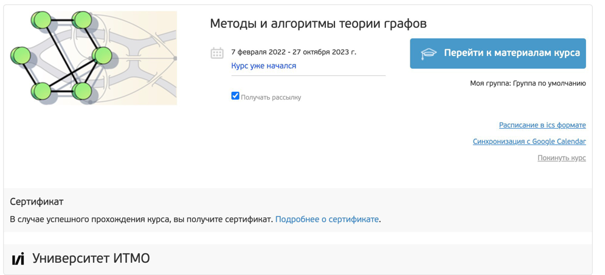
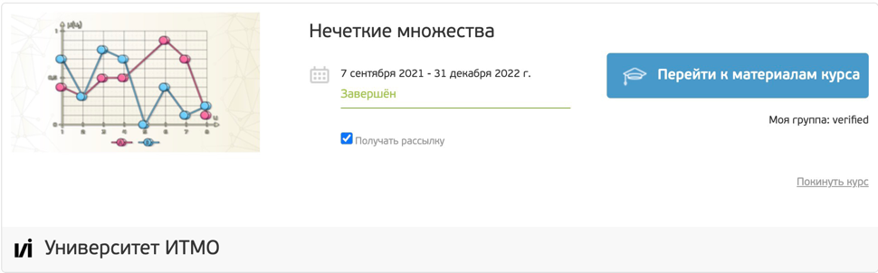
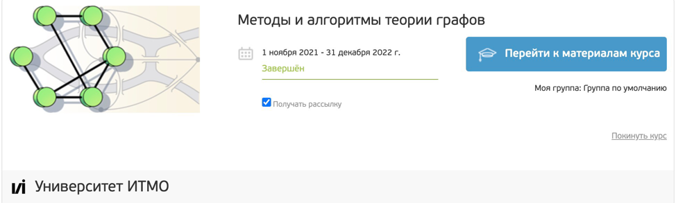
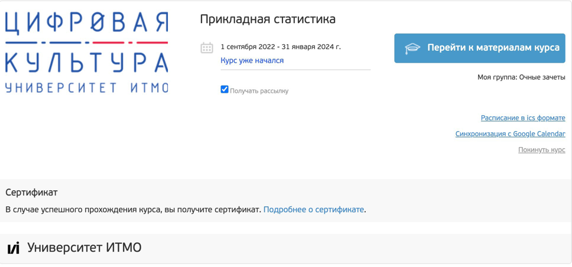
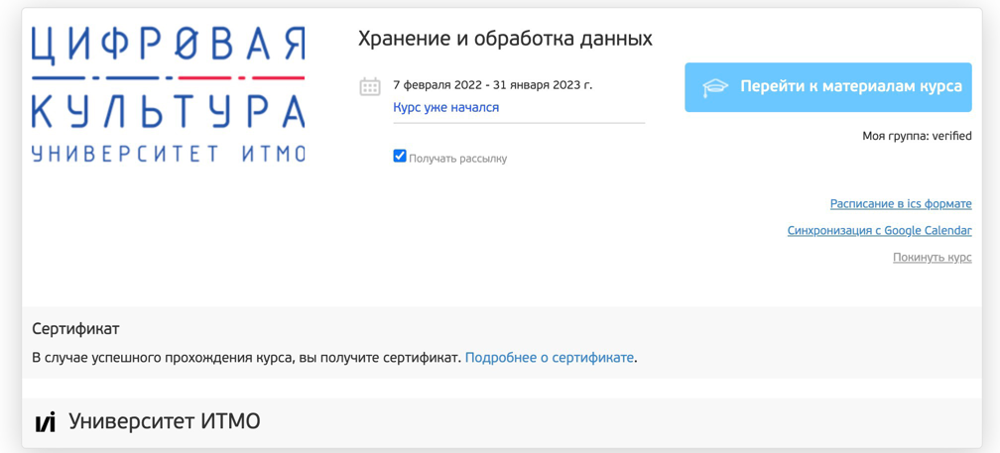
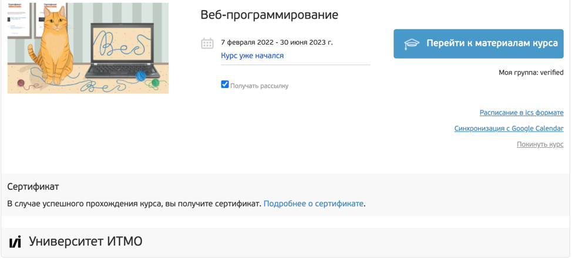

# MyCourses

My Finished Courses up to 3 semesters inclusive

## Stepik

С++: https://stepik.org/course/363/syllabus  
С: https://stepik.org/course/73618/syllabus

## OpenEdu

### --- Discrete Math

### --- Statistics

### --- Data Science

### --- UNIX & LINUX

### --- WEB (HTML, CSS)

